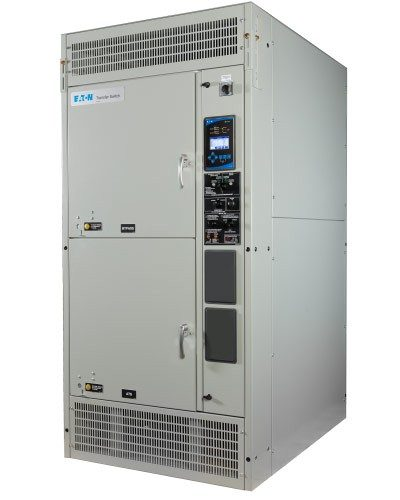

# Unidad 7. Arquitectura de centros de proceso de datos

Un centro de procesamiento de datos o CPD (Data Center en inglés) es el lugar o las instalaciones donde se centralizan todas las operaciones e infraestructura de IT de una organización. Aquí se almacenan y procesan los datos y aplicaciones de la misma.

Usualmente es utilizado por medianas y grandes empresas ya que el costo de implementación y mantenimiento es elevado. Existen CPDs “pequeños” que pueden ocupar una sala, o ser enormes centros que ocupan varios pisos de un edificio.

En este sentido, para las compañías la seguridad es un factor importante no solo en lo que a conexiones refiere sino a lo físico. Los Data Centers pueden tener sistemas anti vibraciones para cuidar la vida de los discos de almacenamiento, sistemas contra incendios especiales para equipos electrónicos y por supuesto, un acceso restringido al área. 

https://www.youtube.com/watch?v=cXVteLWfzQg&ab_channel=Socalcamperz

# Elementos de un CPD

* Servidores
* Almacenamiento
* Refrigeración
* Energía
* Seguridad
* Conectividad
* Monitorización

# Estándar TIA 942. TIER

La **ANSI/TIA-942** es definida como un estándar de calidad creada por el American National Standards Institute (ANSI, por sus siglas en inglés) y el Telecommunications Industry Association (TIA, por sus siglas en inglés) para lograr la adecuada implementación de Data Center a nivel mundial.

Este estándar permite establecer un criterio de medición de los Data Center en cuanto a la parte física, así como su localización, sistema de suministro eléctrico, acondicionamiento térmico, y demás parámetros requeridos del estándar. 

En síntesis, proporciona una serie de recomendaciones y directrices (guidelines) para la instalación de sus infraestructuras.

Cuando una empresa desea validar sus instalaciones debe contar con la certificación adecuada, cumpliendo con los estándares o normas que abarcan en ese entorno.

En el caso de los Data Center, deben cumplir los alcances que establece el estándar ANSI/TIA-942-B.

Este alcance determina las áreas o funcionalidades que serán revisadas, evaluadas y certificadas según los parámetros de la norma, tales como:

*Infraestructura eléctrica.
*Sistema mecánico de enfriamiento.
*Ubicación del Data Center.
*Arquitectura del Data Center.
*Seguridad de Datos.
*Seguridad de las instalaciones.
*Sistemas de detección y supresión de incendios.

## TIER
Los estándar TIA 942 también incorporan la clasificación de los Data Center, conociendo esta clasificación como Tier, los cuáles son unos indicadores que nos sirven para conocer las capacidades y instalaciones de los Data Center

Estos Tier se componen, actualmente, de cuatro niveles diferentes que nos marcan principalmente la disponibilidad de estos, y los tiempos máximos que estos centros de datos pueden estar inoperativos durante un año. Podríamos obtener la siguiente tabla resumen sobre esta clasificación:

* **Tier I:** Es un CPD básico, sin características ni medidas contra fallos inesperados. Tiene todas las funcionalidades básicas de un CPD y permite interrupciones planeadas o no planeadas.
* **Tier II:** Este tipo de CPD cuenta ya con dispositivos redundantes que permite aguantar fallos o interrupciones no planeadas. Cuenta ya con suelo técnico, generador de reserva y alguna medida de redundancia más avanzada que los dispositivos básicos.
* **Tier III:** La característica principal que supone tener este Tier es la redundancia en la línea de alimentación. Esto permite mantenimiento y caídas de tensión sin perder disponibilidad del CPD. Se debe poder realizar tareas de mantenimiento de los dispositivos sin interrumpir el servicio. La mayoría de estos CPDs se construyen para ser convertidos en el siguiente Tier según aumente la demanda de la empresa.
* **Tier IV:** Categoria maxima de un CPD. Debe permitir que los servicios estén siempre activos soportando cualquier tipo de fallo. La redundancia de alimentación pasa a ser alimentación simultánea para no perder tiempo en un posible fallo.

# Servidores

## Rack

Un armario o rack es un bastidor dedicado a alojar equipos informáticos y electrónica de red en un CPD. La característica principal de este tipo de bastidores es la optimización que se hace del espacio cuando se dispone de mucho equipamiento. Hay que contar que el equipamiento utilizado en CPDs tiene formas y tamaños específicos para ubicarse en estos armarios y ahorrar el mayor espacio posible.

  

## U
Una unidad rack o simplemente U es una unidad de medida usada para describir la altura del equipamiento preparado para ser montado en un rack de 19 o 23 pulgadas de ancho (48,26 cm o 58,42 cm). Una unidad rack equivale a 1,75 pulgadas (4,445 cm) de alto.

Una unidad de rack se escribe normalmente como 1U; del mismo modo dos unidades se escribe 2U y así sucesivamente. La altura de una pieza del equipamiento de un rack es frecuentemente descrita como un número en U.

Un uso común para un rack de 19 pulgadas (también llamado bastidor de 19 pulgadas) es alojar servidores permitiendo configuraciones hardware densas sin ocupar excesivo espacio ni requerir estanterías. La gran mayoría de los racks son de 42U, aproximadamente 78 pulgadas (2 metros) de altura. Normalmente equipo profesional de audio y vídeo viene con opciones de montaje en rack y usa las mismas especificaciones de medida

# Energía

## PDU

Una unidad de distribución de energía PDU (Power distribution unit) por sus siglas en inglés) es un dispositivo para controlar la energía eléctrica en un centro de datos. Las PDU más básicas son grandes regletas sin protección contra sobretensiones. Están diseñadas para proporcionar tomas de corriente estándar para los equipos del centro de datos y no tienen capacidad de supervisión ni de acceso remoto. Las PDU más avanzadas ofrecen funciones de supervisión en tiempo real y acceso remoto.

Las PDU gestionan y distribuyen la electricidad y normalmente se instalan directamente en un rack. La fuente de alimentación puede ser corriente alterna (CA) o corriente continua (CC). Puede proceder de un sistema de alimentación ininterrumpida o SAI, de un proveedor de energía de la red pública o de un generador u otra fuente de energía secundaria. Las PDU también están diseñadas para cumplir con requisitos de alimentación que suelen ser mucho mayores que las regletas y los protectores de sobretensión domésticos o de oficina.

## ATS. Interruptor de transferencia automática (ATS)

Un conmutador de transferencia automática es un interruptor eléctrico que cambia el suministro de energía entre la fuente primaria y la de reserva cuando se produce una interrupción del suministro de energía en cualquiera de las fuentes. Al detectar un fallo en la fuente de alimentación primaria, el ATS activa la fuente de alimentación alternativa, como un sistema de alimentación ininterrumpida. También es capaz de poner en marcha generadores diésel para que funcionen los aparatos eléctricos hasta que se restablezca el suministro eléctrico.

Un conmutador de transferencia automática actúa como intermediario entre el equipo eléctrico y la fuente de alimentación. Es esencial disponer de energía ininterrumpida en el centro de datos. Para su correcto mantenimiento, los sistemas conectados a la red eléctrica deben ser debidamente revisados y probados. Para garantizar la fiabilidad de un ATS durante un corte de energía, los administradores del centro de datos deben supervisarlo regularmente.

## SAI. Sistema alimentación ininterrumpida

SAI o UPS (Uninterrupted Power Supply)

# Refrigeración

La producción de calor de los equipos que conforman un centro de datos es uno de los problemas principales y que más preocupa a sus administradores. El exceso de calor en una sala de servidores afecta negativamente el rendimiento del equipo y acorta su vida útil, además de suponer un peligro en el caso de alcanzar niveles elevados. Por eso, es de vital importancia el diseño de un buen sistema de refrigeración de los centros de datos.

En este diseño es fundamental el dimensionamiento del sistema, que exige comprender la cantidad de calor producida por los equipos TI, así como la derivada del funcionamiento de otros elementos habitualmente presentes como los SAI, la distribución de alimentación, unidades de aire acondicionado, iluminación y personas…

Fijarse en todo ello es básico para calcular la carga térmica. En una instalación típica, las cargas que más peso tienen son:

* El 70% se suele corresponder con la carga de los equipos TI.
* El 9%, a la iluminación.
* El 6%, a la distribución de la alimentación.
* El 2%, a las personas.

https://www.youtube.com/watch?v=vZkA0z9JRgw&ab_channel=TheEngineeringMindset

# Monitorización

Cuando se dispone de tanto equipamiento informático (en un solo CPD puede haber cientos de equipos informáticos y otros dispositivos) se hace muy necesario poder monitorizar su comportamiento. No es posible evaluar el rendimiento o vigilar los equipos de forma manual.

Herramientas como Nagios [Nagios](https://www.nagios.org/) permiten monitorizar todo el equipamiento informático de una manera automática y gráfica, de manera que en caso de fallo es la propia aplicación quién avisa a los técnicos del equipo que ha fallado y por qué.

# Bibliografía
* https://ucloudglobal.com/blog/centro-procesamiento-de-datos/
* https://es.wikipedia.org/wiki/Unidad_rack
* https://www.cofrico.com/procesos-industriales/la-refrigeracion-de-los-centros-de-datos/

